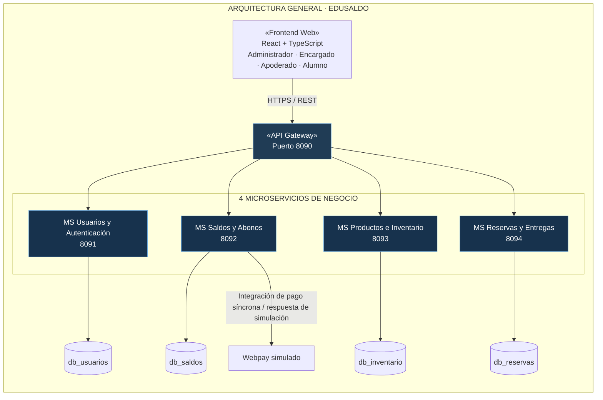

# Arquitectura general de EduSaldo · topología en estrella (Hub & Spoke)

```mermaid
flowchart TB
    subgraph ARQ["ARQUITECTURA GENERAL · EDUSALDO"]
      direction TB
      WEB["«Frontend Web»<br/>React + TypeScript<br/>Administrador · Encargado · Apoderado · Alumno"]
      GW["«API Gateway»<br/>Puerto 8090"]

      WEB -->|"HTTPS / REST"| GW

      subgraph MS["4 MICROSERVICIOS DE NEGOCIO"]
        direction LR
        U["MS Usuarios y Autenticación<br/>8091"]
        S["MS Saldos y Abonos<br/>8092"]
        I["MS Productos e Inventario<br/>8093"]
        R["MS Reservas y Entregas<br/>8094"]
      end

      GW --> U
      GW --> S
      GW --> I
      GW --> R

      U --> DU[("db_usuarios")]
      S --> DS[("db_saldos")]
      I --> DI[("db_inventario")]
      R --> DR[("db_reservas")]

      S -->|"Integración de pago síncrona / respuesta de simulación"| WP["Webpay simulado"]
    end

    classDef ms fill:#17324d,stroke:#65a6df,color:#ffffff
    classDef gateway fill:#203c55,stroke:#8cbce8,color:#ffffff

    class U,S,I,R ms
    class GW gateway
```
