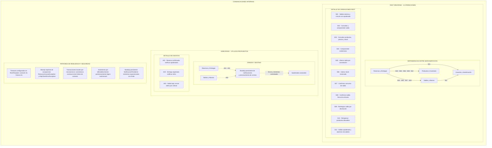

# Comunicaciones internas · REST síncrono, flujos asíncronos y resiliencia (EduSaldo)

```mermaid
flowchart TB
    subgraph COM["COMUNICACIONES INTERNAS"]
      direction TB

      subgraph REST["REST SÍNCRONO · 11 OPERACIONES"]
        direction TB

        subgraph RF["DEPENDENCIAS ENTRE MICROSERVICIOS"]
          direction LR
          RR["Reservas y Entregas"]
          SS["Saldos y Abonos"]
          II["Productos e Inventario"]
          UU["Usuarios y Autenticación"]

          RR -->|"S01"| UU
          RR -->|"S02 · S05 · S07 · S09"| SS
          RR -->|"S03 · S04 · S06 · S08 · S10"| II
          SS -->|"S11"| UU
        end

        subgraph RD["DETALLE DE OPERACIONES REST"]
          direction LR
          D1["S01 · Validar alumno y vínculo con apoderado"]
          D2["S02 · Consultar y comprometer saldo"]
          D3["S03 · Consultar productos, precios y stock"]
          D4["S04 · Comprometer existencias"]
          D5["S05 · Liberar saldo por cancelación"]
          D6["S06 · Liberar stock reservado"]
          D7["S07 · Confirmar consumo de saldo"]
          D8["S08 · Confirmar salida física de artículos"]
          D9["S09 · Reintegrar saldo por devolución"]
          D10["S10 · Reingresar productos devueltos"]
          D11["S11 · Validar apoderado y alumnos vinculados"]
        end
      end

      subgraph ASYNC["ASÍNCRONO · 3 FLUJOS PROPUESTOS"]
        direction TB

        subgraph AF["ORIGEN Y DESTINO"]
          direction LR
          RE["Reservas y Entregas"]
          SA["Saldos y Abonos"]
          MAIL["Bandeja persistente de notificaciones<br/>y procesamiento de correos"]
          APO["Apoderados asociados"]

          RE -.->|"A01 · A02"| MAIL
          SA -.->|"A03"| MAIL
          MAIL -.->|"Envío y reintentos controlados"| APO
        end

        subgraph AD["DETALLE DE EVENTOS"]
          direction LR
          A1["A01 · Reserva confirmada: notificar apoderados"]
          A2["A02 · Entrega registrada: notificar retiro"]
          A3["A03 · Saldo bajo: enviar alerta por umbral"]
        end
      end

      subgraph RES["PATRONES DE RESILIENCIA Y SEGURIDAD"]
        direction TB
        R1["Timeouts configurados en RestTemplate: conexión 3s / lectura 5s"]
        R2["Manejo explícito de excepciones: ResourceAccessException y HttpClientErrorException"]
        R3["Transacciones locales por microservicio: consistencia eventual entre límites de contexto"]
        R4["Aislamiento por idEstablecimiento: particionamiento lógico multi-tenant"]
        R5["Bandeja persistente NotificacionPendiente: reintentos exponenciales con límite"]
      end
    end
```
