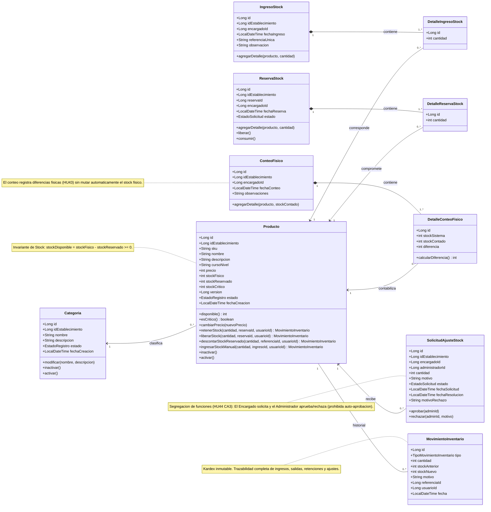

# Modelo de dominio · MS Productos e Inventario (8093 · db_inventario)

```mermaid
classDiagram
direction LR

class Categoria {
  +Long id
  +Long idEstablecimiento
  +String nombre
  +String descripcion
  +EstadoRegistro estado
  +LocalDateTime fechaCreacion
  +modificar(nombre, descripcion)
  +inactivar()
  +activar()
}

class Producto {
  +Long id
  +Long idEstablecimiento
  +String sku
  +String nombre
  +String descripcion
  +String cursoNivel
  +int precio
  +int stockFisico
  +int stockReservado
  +int stockCritico
  +Long version
  +EstadoRegistro estado
  +LocalDateTime fechaCreacion
  +disponible() int
  +esCritico() boolean
  +cambiarPrecio(nuevoPrecio)
  +retenerStock(cantidad, reservaId, usuarioId) MovimientoInventario
  +liberarStock(cantidad, reservaId, usuarioId) MovimientoInventario
  +descontarStockReservado(cantidad, referenciaId, usuarioId) MovimientoInventario
  +ingresarStockManual(cantidad, ingresoId, usuarioId) MovimientoInventario
  +inactivar()
  +activar()
}

class IngresoStock {
  +Long id
  +Long idEstablecimiento
  +Long encargadoId
  +LocalDateTime fechaIngreso
  +String referenciaUnica
  +String observacion
  +agregarDetalle(producto, cantidad)
}

class DetalleIngresoStock {
  +Long id
  +int cantidad
}

class ReservaStock {
  +Long id
  +Long idEstablecimiento
  +Long reservaId
  +Long encargadoId
  +LocalDateTime fechaReserva
  +EstadoSolicitud estado
  +agregarDetalle(producto, cantidad)
  +liberar()
  +consumir()
}

class DetalleReservaStock {
  +Long id
  +int cantidad
}

class ConteoFisico {
  +Long id
  +Long idEstablecimiento
  +Long encargadoId
  +LocalDateTime fechaConteo
  +String observaciones
  +agregarDetalle(producto, stockContado)
}

class DetalleConteoFisico {
  +Long id
  +int stockSistema
  +int stockContado
  +int diferencia
  +calcularDiferencia() int
}

class SolicitudAjusteStock {
  +Long id
  +Long idEstablecimiento
  +Long encargadoId
  +Long administradorId
  +int cantidad
  +String motivo
  +EstadoSolicitud estado
  +LocalDateTime fechaSolicitud
  +LocalDateTime fechaResolucion
  +String motivoRechazo
  +aprobar(adminId)
  +rechazar(adminId, motivo)
}

class MovimientoInventario {
  +Long id
  +TipoMovimientoInventario tipo
  +int cantidad
  +int stockAnterior
  +int stockNuevo
  +String motivo
  +Long referenciaId
  +Long usuarioId
  +LocalDateTime fecha
}

Categoria "1" <-- "0..*" Producto : clasifica

IngresoStock "1" *-- "1..*" DetalleIngresoStock : contiene
Producto "1" <-- "0..*" DetalleIngresoStock : corresponde

ReservaStock "1" *-- "1..*" DetalleReservaStock : contiene
Producto "1" <-- "0..*" DetalleReservaStock : compromete

ConteoFisico "1" *-- "1..*" DetalleConteoFisico : contiene
Producto "1" <-- "0..*" DetalleConteoFisico : contabiliza

Producto "1" <-- "0..*" SolicitudAjusteStock : recibe
Producto "1" -- "0..*" MovimientoInventario : historial

note for Producto "Invariante de Stock: stockDisponible = stockFisico - stockReservado >= 0."
note for ConteoFisico "El conteo registra diferencias fisicas (HU43) sin mutar automaticamente el stock fisico."
note for SolicitudAjusteStock "Segregacion de funciones (HU44 CA3): El Encargado solicita y el Administrador aprueba/rechaza (prohibida auto-aprobacion)."
note for MovimientoInventario "Kardex inmutable. Trazabilidad completa de ingresos, salidas, retenciones y ajustes."
```
