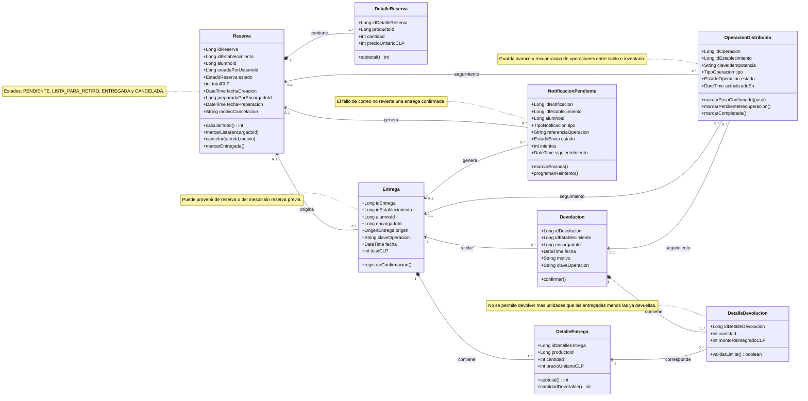

# Modelo de dominio · MS Reservas, Entregas y Devoluciones (8094 · db_reservas)

```mermaid
classDiagram
direction LR

class Reserva {
  +Long idReserva
  +Long idEstablecimiento
  +Long alumnoId
  +Long creadaPorUsuarioId
  +EstadoReserva estado
  +int totalCLP
  +DateTime fechaCreacion
  +Long preparadaPorEncargadoId
  +DateTime fechaPreparacion
  +String motivoCancelacion
  +calcularTotal() int
  +marcarLista(encargadoId)
  +cancelar(actorId,motivo)
  +marcarEntregada()
}

class DetalleReserva {
  +Long idDetalleReserva
  +Long productoId
  +int cantidad
  +int precioUnitarioCLP
  +subtotal() int
}

class Entrega {
  +Long idEntrega
  +Long idEstablecimiento
  +Long alumnoId
  +Long encargadoId
  +OrigenEntrega origen
  +String claveOperacion
  +DateTime fecha
  +int totalCLP
  +registrarConfirmacion()
}

class DetalleEntrega {
  +Long idDetalleEntrega
  +Long productoId
  +int cantidad
  +int precioUnitarioCLP
  +subtotal() int
  +cantidadDevolvible() int
}

class Devolucion {
  +Long idDevolucion
  +Long idEstablecimiento
  +Long encargadoId
  +DateTime fecha
  +String motivo
  +String claveOperacion
  +confirmar()
}

class DetalleDevolucion {
  +Long idDetalleDevolucion
  +int cantidad
  +int montoReintegradoCLP
  +validarLimite() boolean
}

class OperacionDistribuida {
  +Long idOperacion
  +Long idEstablecimiento
  +String claveIdempotencia
  +TipoOperacion tipo
  +EstadoOperacion estado
  +DateTime actualizadoEn
  +marcarPasoConfirmado(paso)
  +marcarPendienteRecuperacion()
  +marcarCompletada()
}

class NotificacionPendiente {
  +Long idNotificacion
  +Long idEstablecimiento
  +Long alumnoId
  +TipoNotificacion tipo
  +String referenciaOperacion
  +EstadoEnvio estado
  +int intentos
  +DateTime siguienteIntento
  +marcarEnviada()
  +programarReintento()
}

Reserva "1" *-- "1..*" DetalleReserva : contiene
Reserva "0..1" <-- "0..1" Entrega : origina

Entrega "1" *-- "1..*" DetalleEntrega : contiene
Entrega "1" <-- "0..*" Devolucion : recibe
Devolucion "1" *-- "1..*" DetalleDevolucion : contiene
DetalleEntrega "1" <-- "0..*" DetalleDevolucion : corresponde

Reserva "0..1" <-- "0..*" OperacionDistribuida : seguimiento
Entrega "0..1" <-- "0..*" OperacionDistribuida : seguimiento
Devolucion "0..1" <-- "0..*" OperacionDistribuida : seguimiento

Reserva "0..1" <-- "0..*" NotificacionPendiente : genera
Entrega "0..1" <-- "0..*" NotificacionPendiente : genera

note for Reserva "Estados: PENDIENTE, LISTA_PARA_RETIRO, ENTREGADA y CANCELADA."
note for Entrega "Puede provenir de reserva o del meson sin reserva previa."
note for DetalleDevolucion "No se permite devolver mas unidades que las entregadas menos las ya devueltas."
note for OperacionDistribuida "Guarda avance y recuperacion de operaciones entre saldo e inventario."
note for NotificacionPendiente "El fallo de correo no revierte una entrega confirmada."
```