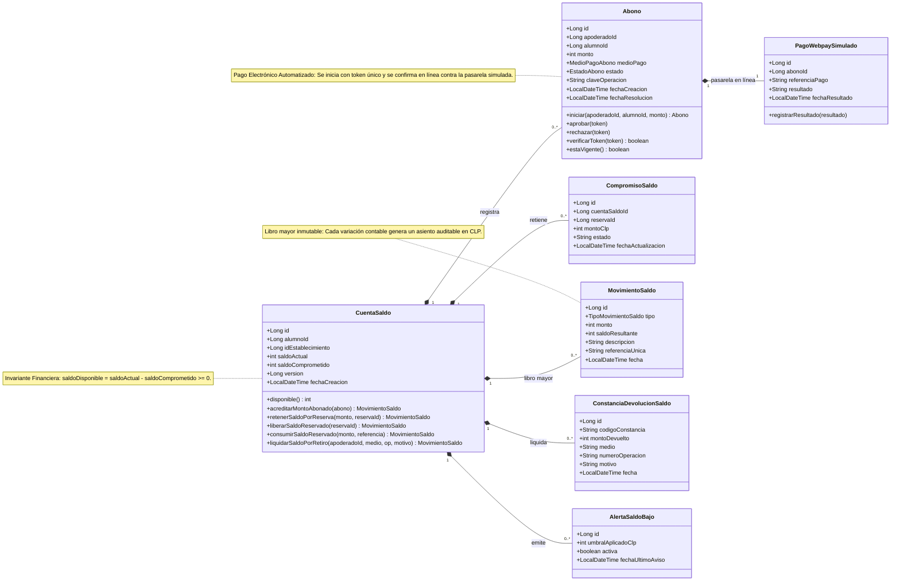

# Modelo de dominio · MS Saldos y Abonos (8092 · db_saldos)

```mermaid
classDiagram
direction LR

class CuentaSaldo {
  +Long id
  +Long alumnoId
  +Long idEstablecimiento
  +int saldoActual
  +int saldoComprometido
  +Long version
  +LocalDateTime fechaCreacion
  +disponible() int
  +acreditarMontoAbonado(abono) MovimientoSaldo
  +retenerSaldoPorReserva(monto, reservaId) MovimientoSaldo
  +liberarSaldoReservado(reservaId) MovimientoSaldo
  +consumirSaldoReservado(monto, referencia) MovimientoSaldo
  +liquidarSaldoPorRetiro(apoderadoId, medio, op, motivo) MovimientoSaldo
}

class Abono {
  +Long id
  +Long apoderadoId
  +Long alumnoId
  +int monto
  +MedioPagoAbono medioPago
  +EstadoAbono estado
  +String claveOperacion
  +LocalDateTime fechaCreacion
  +LocalDateTime fechaResolucion
  +iniciar(apoderadoId, alumnoId, monto) Abono
  +aprobar(token)
  +rechazar(token)
  +verificarToken(token) boolean
  +estaVigente() boolean
}

class PagoWebpaySimulado {
  +Long id
  +Long abonoId
  +String referenciaPago
  +String resultado
  +LocalDateTime fechaResultado
  +registrarResultado(resultado)
}

class CompromisoSaldo {
  +Long id
  +Long cuentaSaldoId
  +Long reservaId
  +int montoClp
  +String estado
  +LocalDateTime fechaActualizacion
}

class MovimientoSaldo {
  +Long id
  +TipoMovimientoSaldo tipo
  +int monto
  +int saldoResultante
  +String descripcion
  +String referenciaUnica
  +LocalDateTime fecha
}

class ConstanciaDevolucionSaldo {
  +Long id
  +String codigoConstancia
  +int montoDevuelto
  +String medio
  +String numeroOperacion
  +String motivo
  +LocalDateTime fecha
}

class AlertaSaldoBajo {
  +Long id
  +int umbralAplicadoClp
  +boolean activa
  +LocalDateTime fechaUltimoAviso
}

CuentaSaldo "1" *-- "0..*" Abono : registra
Abono "1" *-- "1" PagoWebpaySimulado : pasarela en línea
CuentaSaldo "1" *-- "0..*" CompromisoSaldo : retiene
CuentaSaldo "1" *-- "0..*" MovimientoSaldo : libro mayor
CuentaSaldo "1" *-- "0..*" ConstanciaDevolucionSaldo : liquida
CuentaSaldo "1" *-- "0..*" AlertaSaldoBajo : emite

note for CuentaSaldo "Invariante Financiera: saldoDisponible = saldoActual - saldoComprometido >= 0."
note for Abono "Pago Electrónico Automatizado: Se inicia con token único y se confirma en línea contra la pasarela simulada."
note for MovimientoSaldo "Libro mayor inmutable: Cada variación contable genera un asiento auditable en CLP."
```
