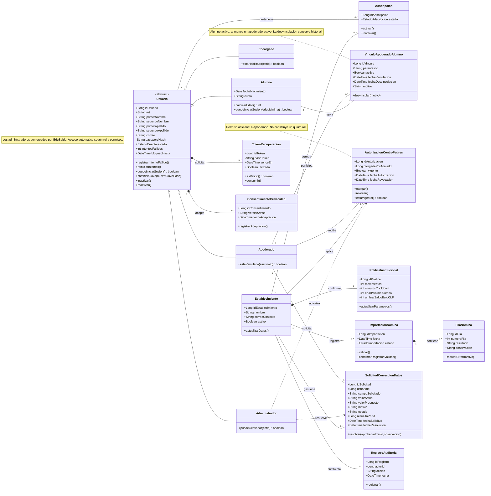

# Modelo de dominio · MS Usuarios y Autenticación (8091 · db_usuarios)

```mermaid
classDiagram
direction LR

class Establecimiento {
  +Long idEstablecimiento
  +String nombre
  +String correoContacto
  +Boolean activo
  +actualizarDatos()
}

class Usuario {
  <<abstract>>
  +Long idUsuario
  +String rut
  +String primerNombre
  +String segundoNombre
  +String primerApellido
  +String segundoApellido
  +String correo
  -String passwordHash
  +EstadoCuenta estado
  +int intentosFallidos
  +DateTime bloqueoHasta
  +registrarIntentoFallido()
  +reiniciarIntentos()
  +puedeIniciarSesion() boolean
  +cambiarClave(nuevaClaveHash)
  +inactivar()
  +reactivar()
}

class Administrador {
  +puedeGestionar(estId) boolean
}

class Encargado {
  +estaHabilitado(estId) boolean
}

class Apoderado {
  +estaVinculado(alumnoId) boolean
}

class Alumno {
  +Date fechaNacimiento
  +String curso
  +calcularEdad() int
  +puedeIniciarSesion(edadMinima) boolean
}

class Adscripcion {
  +Long idAdscripcion
  +EstadoAdscripcion estado
  +activar()
  +inactivar()
}

class VinculoApoderadoAlumno {
  +Long idVinculo
  +String parentesco
  +Boolean activo
  +DateTime fechaVinculacion
  +DateTime fechaDesvinculacion
  +String motivo
  +desvincular(motivo)
}

class AutorizacionCentroPadres {
  +Long idAutorizacion
  +Long otorgadaPorAdminId
  +Boolean vigente
  +DateTime fechaAutorizacion
  +DateTime fechaRevocacion
  +otorgar()
  +revocar()
  +estaVigente() boolean
}

class PoliticaInstitucional {
  +Long idPolitica
  +int maxIntentos
  +int minutosCooldown
  +int edadMinimaAlumno
  +int umbralSaldoBajoCLP
  +actualizarParametros()
}

class TokenRecuperacion {
  +Long idToken
  -String hashToken
  +DateTime venceEn
  +Boolean utilizado
  +esValido() boolean
  +consumir()
}

class ConsentimientoPrivacidad {
  +Long idConsentimiento
  +String versionAviso
  +DateTime fechaAceptacion
  +registrarAceptacion()
}

class ImportacionNomina {
  +Long idImportacion
  +DateTime fecha
  +EstadoImportacion estado
  +validar()
  +confirmarRegistrosValidos()
}

class FilaNomina {
  +Long idFila
  +int numeroFila
  +String resultado
  +String observacion
  +marcarError(motivo)
}

class SolicitudCorreccionDatos {
  +Long idSolicitud
  +Long usuarioId
  +String campoSolicitado
  +String valorActual
  +String valorPropuesto
  +String motivo
  +String estado
  +Long resueltaPorId
  +DateTime fechaSolicitud
  +DateTime fechaResolucion
  +resolver(aprobar,adminId,observacion)
}

class RegistroAuditoria {
  +Long idRegistro
  +Long actorId
  +String accion
  +DateTime fecha
  +registrar()
}

Usuario <|-- Administrador
Usuario <|-- Encargado
Usuario <|-- Apoderado
Usuario <|-- Alumno

Usuario "1" -- "0..*" Adscripcion : pertenece
Establecimiento "1" -- "0..*" Adscripcion : agrupa

Apoderado "1" -- "0..*" VinculoApoderadoAlumno : participa
Alumno "1" -- "1..*" VinculoApoderadoAlumno : tiene

Apoderado "1" -- "0..*" AutorizacionCentroPadres : recibe
Establecimiento "1" -- "0..*" AutorizacionCentroPadres : aplica
Administrador ..> AutorizacionCentroPadres : autoriza

Establecimiento "1" *-- "1" PoliticaInstitucional : configura
Usuario "1" *-- "0..*" TokenRecuperacion : solicita
Usuario "1" *-- "0..*" ConsentimientoPrivacidad : acepta

Establecimiento "1" -- "0..*" ImportacionNomina : registra
ImportacionNomina "1" *-- "1..*" FilaNomina : contiene

Apoderado "1" -- "0..*" SolicitudCorreccionDatos : solicita
Administrador ..> SolicitudCorreccionDatos : resuelve
Establecimiento "1" -- "0..*" SolicitudCorreccionDatos : gestiona

Establecimiento "1" -- "0..*" RegistroAuditoria : conserva

note for Usuario "Los administradores son creados por EduSaldo. Acceso automático según rol y permisos."
note for VinculoApoderadoAlumno "Alumno activo: al menos un apoderado activo. La desvinculación conserva historial."
note for AutorizacionCentroPadres "Permiso adicional a Apoderado. No constituye un quinto rol."
```
